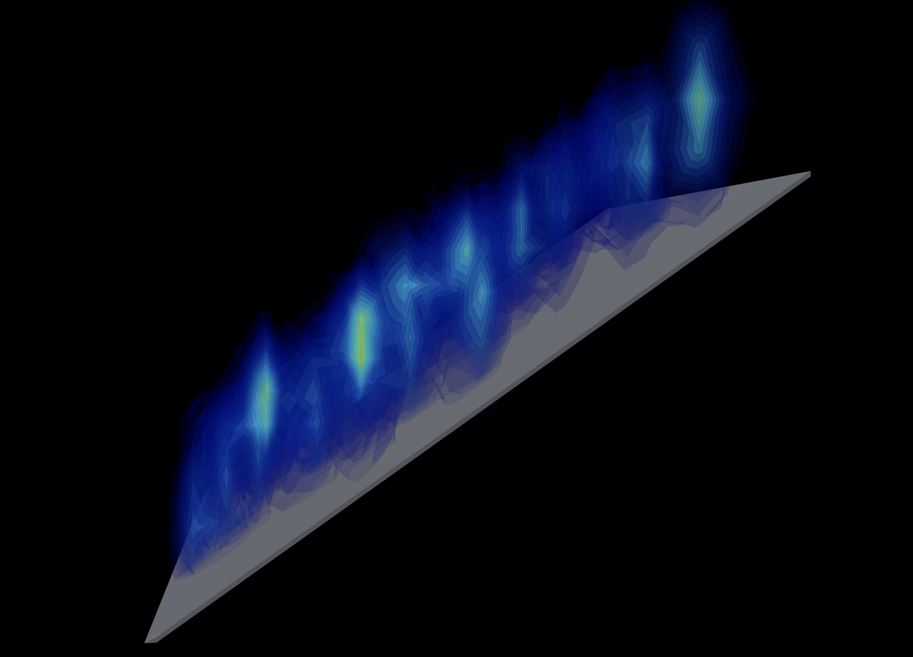

# DefectNetwork
This repository simulates the formation of defects network near a saturated grain boundary

The project consists of three parts: 
1. Simulating multiple batches of **prismatic loop evolution** using kMC algorithm embedded with Dislocation Dynamics module [dd3d_diffuse.m](dd3d_diffuse.m), all results from different batches are 'parallel' and stiched together using [merge.m](merge.m) and the [dislocation data files](dislocation.txt) are exported from it.
2. Generating **cubic volume tessellation** with the [tessellation_orthogonal.m](tessellation_orthogonal.m). The [output](orthogonal20/n20_vorvx0.txt) contains all the vertices of each volume element. 
3. Conducting **GND signal analysis** with [main.py](GND_3d_analysis/main.py), which reads both the [dislocation data](dislocation.txt) and [volume_mesh data](GND_3d_analysis/orthogonal_merged20/n20_vorvx1.txt). It outputs information about dislocation segments after being truncated by volume cells, the volume, vertice and GND content of each volume cell.
4. Generating **GND signal 3D map**. Running [voro_plot.m](GND_3d_analysis/voro_plot.m) will produce [result](GND_3d_analysis/orthogonal_merged20_voro_color.txt), which is rendered in [3d_rendering.py](GND_rendering/3d_rendering.py) for final 3d image of GND signal near the GB.

## Table of Contents

- [Install](#install)
- [Usage](#usage)
- [Examples](#example)
- [Maintainers](#maintainers)
- [Contributing](#contributing)
- [License](#license)

## Install

This project consists of code developed in [Python](https://www.python.org/) and [MATLAB](https://www.mathworks.com/products/matlab.html). Commercial Software [OVITO](https://www.ovito.org/) is used for data processing. 

## Usage

### kinetic Monte Carlo/Dislocation Dynamics simulation of defect evolution
Simulation starts by running [dd3d_diffuse.m](dd3d_diffuse.m), with simulation parameters specified in [input_bes.m](input_bes.m). After simulation time is fulfilled, the dislocation network information is stored in **relaxround.mat**. This file will can be used by [merge.m](merge.m) to form bigger dislocation network. The result will be written into [dislocation.txt](dislocation.txt) and [dislocation_burgers.txt](dislocation_burgers.txt).

### Spatial tessellation
Aftern tunning the simulation box size and number of meshed elements in the [tessellation_orthogonal.m](tessellation_orthogonal.m), execution of the code will save the coordinates of all volume mesh vertices into text files in the designated directory.

### Gaussian 3d GND analysis
The [main.py](GND_3d_analysis/main.py) calculates the GND density by combining the dislocation information and meshed volumes. The output from this script includes: 
1. Simulation parameters like the mesh size and the dimension of the simulation volume; 
2. Volume of each meshed volume element; 
3. GND signal intensity of each meshed volume element; 
4. Vertices of dislocation segments with the truncating effect of meshed volume elements; 
5. The correspondence between each dislocation segment and the meshed volume element that fully contains it.

The output of [main.py](GND_3d_analysis/main.py) will be further analyzed by [voro_plot.m](GND_3d_analysis/voro_plot.m) to generate [final 3d GND signal](GND_3d_analysis/orthogonal_merged20_voro_color.txt) ready for rendering. 

### Analyze GND calculation
Use [3d_rendering.py](GND_rendering/3d_rendering.py) to process the [orthogonal_merged20_voro_color.txt](GND_3d_analysis/orthogonal_merged20_voro_color.txt) and we get    

## Maintainers

[@AlanHe](https://github.com/hsc1993).

## Contributing

### Contributors

This project is supported by research group at UCLA, Johns Hopkins University, Hongkong City University and Pennsylvania University.

## License

[MIT](LICENSE) © Sicong He

